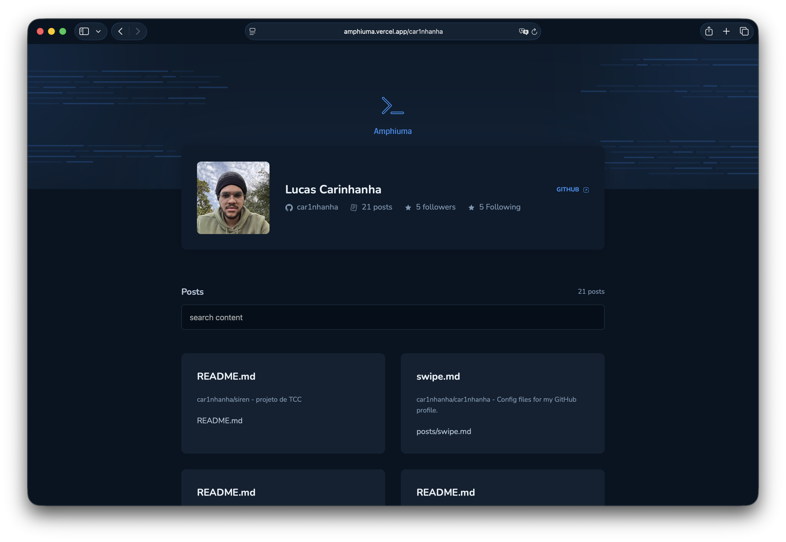

# Amphiuma

> Um projeto fullstack para descobrir, listar e renderizar arquivos Markdown direto do GitHub, com frontend moderno e backend em Go.


---



---

## Visão Geral

O Amphiuma conecta dois mundos:

- Frontend com Vue 3 + Vite para uma experiência rápida e elegante
- Backend em Go + Gin para buscar e tratar conteúdo no GitHub

Com ele você consegue:

- Descobrir arquivos por usuário e extensão
- Abrir conteúdo Markdown de repositórios
- Ler metadados de front matter quando existirem

---

## Stack Tecnológica

### Frontend

- Vue 3
- Vite
- TypeScript
- Vue Router
- Marked
- date-fns
- Shiki
- Iconify

### Backend

- Go 1.24+
- Gin
- CORS
- Integração com GitHub API

---

## Estrutura do Projeto

```bash
.
├── api
│   ├── cmd
│   │   └── api
│   │       └── main.go
│   ├── go.mod
│   ├── go.sum
│   ├── internal
│   │   ├── files
│   │   │   ├── find_files.go
│   │   │   ├── get_file.go
│   │   │   ├── get_user.go
│   │   │   └── handler.go
│   │   └── interfaces
│   │       ├── find_github.go
│   │       └── github_response.go
│   └── pkg
│       └── utils
│           └── base64.go
├── app
│   ├── blog.png
│   ├── index.html
│   ├── package.json
│   ├── public
│   │   ├── amphiuma.png
│   │   ├── front-metter.png
│   │   ├── header-effect-left.svg
│   │   ├── header-effect-right.svg
│   │   ├── terminal-solid.svg
│   │   ├── test.md
│   │   └── vite.svg
│   ├── README.md
│   ├── src
│   │   ├── assets
│   │   │   ├── scroll-down.json
│   │   │   └── vue.svg
│   │   ├── components
│   │   │   ├── atoms
│   │   │   │   └── input-text.vue
│   │   │   ├── molecules
│   │   │   │   ├── Card-header.vue
│   │   │   │   ├── Card-posts.vue
│   │   │   │   ├── CardLanding.vue
│   │   │   │   └── CodeBlock.vue
│   │   │   ├── organisms
│   │   │   │   ├── Header.vue
│   │   │   │   └── Stylize-post.vue
│   │   │   ├── pages
│   │   │   │   ├── Home.vue
│   │   │   │   ├── landing
│   │   │   │   │   ├── landing.css
│   │   │   │   │   └── Landing.vue
│   │   │   │   └── Post.vue
│   │   │   └── templates
│   │   │       └── Defaut.vue
│   │   ├── main.ts
│   │   ├── reset.css
│   │   ├── style.css
│   │   └── types
│   │       └── json.d.ts
│   ├── tsconfig.app.json
│   ├── tsconfig.json
│   ├── tsconfig.node.json
│   ├── vercel.json
│   └── vite.config.ts
└── README.md
```

---

## Pré-requisitos

- Node.js 18+
- npm
- Go 1.24+

---

## Variáveis de Ambiente

### Backend, arquivo api/.env

```env
GH_PERSONAL_TOKEN=Token ghp_...
IS_RUNNING_LOCAL=true
```

### Frontend, arquivo app/.env

```env
VITE_API_BACKEND=http://localhost:8080
VITE_PROJECT_NAME=Amphiuma
```

Importante:

- Nunca commitar token real no repositório

---

## Instalação

### 1. Frontend

```bash
cd app
npm install
```

### 2. Backend

```bash
cd ../api
go mod tidy
```

---

## Como Rodar em Desenvolvimento

### Backend local

```bash
cd api
IS_RUNNING_LOCAL=true go run ./cmd/api
```

### Frontend

```bash
cd app
npm run dev
```

Endpoints locais:

- Frontend: http://localhost:5173
- Backend: http://localhost:8080

---

## Build do Frontend

```bash
cd app
npm run build
npm run preview
```

---

## Rotas do Frontend

- / -> Landing
- /:user -> Lista de arquivos do usuário
- /:user/:repo/:path -> Visualização de arquivo

---

## Endpoints da API

### GET /:user

Lista arquivos de um usuário no GitHub.

Query params:

- extension, opcional, padrão md

Exemplo:

```bash
curl "http://localhost:8080/car1nhanha?extension=md"
```

### GET /:user/:repo/\*path

Busca conteúdo de um arquivo específico.

Exemplo:

```bash
curl "http://localhost:8080/car1nhanha/amphiuma/README.md"
```

### GET /

Health check da API.

---

## Fluxo da Aplicação

1. Usuário acessa a landing
2. Informa o username do GitHub
3. Frontend chama GET /:user
4. Usuário abre um arquivo
5. Frontend chama GET /:user/:repo/\*path
6. Conteúdo Markdown é renderizado

---

## Autor

Lucas Carinhanha

- GitHub: https://github.com/car1nhanha

---

Feito com código, café e um pouco de caos.
